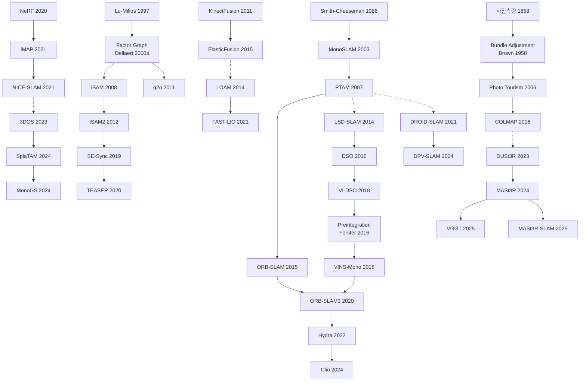

# Ch.19 — 오늘의 지도와 내일의 공란

Ch.0은 2026년의 풍경을 이렇게 묘사했다. 핸드폰을 들면 AR 레이어가 벽에 달라붙는다. 실내 배송 로봇은 지도를 받지 않고도 주방과 회의실을 구분한다. DUSt3R 계열 모델에 사진 몇 장을 던지면 수 초 안에 3D 구조가 나온다. 그 묘사는 정확하다. 그리고 그 묘사는 이 책의 전제를 뒷받침하는 동시에 무너뜨린다.

풀린 것은 2003년의 문제다. 2003년의 SLAM이 설정한 가정들, 정적인 장면, 안정된 조명, 제한된 공간, 단안 카메라의 기하학. 그 가정들 위에서 EKF가 작동했고, graph SLAM이 루프를 닫았으며, ORB-SLAM이 keyframe을 관리했다. 각 답은 진짜 답이고, 각 가정은 진지하게 선택된 단순화였다.

18개 챕터의 마지막 절에는 동일한 표시가 남아 있다. 아직 열린 것들. 창작이 아니다. 수확이다. 각 챕터가 풀었다고 선언하는 자리 바로 옆에 꽂아둔 깃발들을 한 자리에 펼쳐놓는 것이다.

---

## 19.1 조명과 환경 변화: 카메라가 감당하지 못하는 현실

Visual SLAM이 실외로 나온 순간부터 따라다닌 문제가 있다. 카메라의 측광 모델이 감당하지 못하는 조건은 현장에서 항상 먼저 도착한다.

Ch.2의 [SuperPoint](https://arxiv.org/abs/1712.07629), [R2D2](https://arxiv.org/abs/1906.06195), [DISK](https://arxiv.org/abs/2006.13566) 같은 learned descriptor는 훈련 도메인에서 ORB를 능가한다. 그러나 underwater, thermal, low-light 환경에서는 일관성이 없다. 어느 쪽이 더 강건하다는 합의는 2026년에도 없다 (Ch.2 §2.7 참조). Ch.5가 기록한 저조도·동적 환경 추적 실패는 2007년 PTAM이 "Small AR Workspaces"라고 스스로 범위를 제한했던 이유와 같다. 2026년 대부분의 feature-based SLAM이 암묵적으로 유지하는 가정도 마찬가지다 (Ch.5 §🧭 참조).

Direct method 계보에서 이 문제는 더 구조적이다. Ch.8이 정리했듯, direct tracking의 근본 전제(장면의 밝기 분포가 프레임 간 보존된다)는 자동 노출 카메라, 강한 역광, 터널-야외 전환에서 즉각 붕괴한다. VI-DSO의 IMU 보조가 부분적으로 완화하지만, 조명 모델 자체를 동적으로 추정하는 완전한 해법은 아직 나오지 않았다 (Ch.8 §🧭 참조). Place recognition 계보에서도 같은 장벽이 10년 넘게 같은 자리에 있다. [Nordland](https://nikosuenderhauf.github.io/projects/placerecognition/)와 [Oxford RobotCar](https://robotcar-dataset.robots.ox.ac.uk/) 데이터셋에서 보고되는 계절·조명 극변 문제는 [DINOv2](https://arxiv.org/abs/2304.07193) 기반 방법들이 격차를 줄였어도, 눈이 쌓인 겨울과 나뭇잎이 무성한 여름을 99% 정확도로 연결하는 단일 모델은 없다 (Ch.10 §10.7 참조).

ORB-SLAM의 장기 지도 재사용도 같은 경계에 막혀 있다. Atlas가 멀티맵 유지를 가능하게 했지만, 아침에 만든 지도와 저녁에 재방문할 때 장소를 같은 곳으로 인식하는 일이 조명 변화 앞에서 실패한다 (Ch.7 §🧭 참조). 이 문제가 Ch.2·5·7·8·10에서 반복 등장한다는 것은 우연이 아니다. 각 계보가 각자의 언어로 같은 장벽을 보고했을 뿐이다.

---

## 19.2 동적 세계 가정: 가장 오래된 단순화의 한계

정적 세계 가정은 SLAM의 가장 오래된 단순화다. 그리고 이 가정에 가장 많은 챕터가 각자의 깃발을 꽂았다.

Ch.3의 SfM 계보에서 동적 물체 문제는 COLMAP을 포함한 모든 현행 시스템의 공통 취약점이다. 자동차나 보행자가 많은 장면에서 RANSAC이 일부를 걸러내지만, COLMAP 수준의 범용성을 가진 Dynamic SfM 구현체는 2026년 기준 없다 (Ch.3 §3.7 참조). Ch.9의 KinectFusion부터 BundleFusion까지는 모두 정적 장면을 전제로 설계됐다. 사람이 걸어 다니는 공간을 dense하게 재구성하려면 실시간 semantic segmentation과 dense SLAM의 결합이 필요한데, DynaSLAM·MaskFusion 등이 시도했으나 계산 비용과 robustness 모두에서 실용 배포 수준에 미치지 못한다 (Ch.9 §🧭 참조).

Ch.11의 monocular depth 계보에서는 자동차·사람이 움직이는 장면의 photometric consistency 위반이 핵심이다. self-supervised 방법들이 moving object를 masking으로 우회하는데, 이는 문제를 피하는 것이지 푸는 것이 아니다 (Ch.11 §🧭 참조). Ch.15의 3D Gaussian Splatting SLAM은 2025년 기준으로 정적 세계 가정을 유지한다. [4DGS](https://arxiv.org/abs/2310.08528)와 [Deformable 3DGS](https://arxiv.org/abs/2309.13101)가 시간 차원을 Gaussian에 추가하는 방향을 탐색 중이지만, SLAM 설정에서 동적 객체를 표현하고 추적하는 통합된 방식은 아직 없다 (Ch.15 §🧭 참조). Ch.17의 LiDAR SLAM도 면제되지 않는다. Zhang의 2014년 원 논문이 예견한 동적 물체 처리 문제는 2026년에도 같은 자리에 있다. 점군에서 실시간으로 동적 물체를 분리하는 geometry 기반 방법은 연산 비용이 높고 정확도가 일관되지 않으며, Waymo·Argo AI의 자체 솔루션은 공개된 일반 알고리즘이 아니다 (Ch.17 §🧭 참조). 다섯 챕터에서 같은 질문이 반복 등장한다는 것은 아마 올바른 접근법 자체가 아직 나오지 않았기 때문일 것이다.

[Ch.15b](chapter_15b_dynamic.md)가 수확한 long-term dynamic/deformable 문제들도 같은 층위에 앉는다. **Absence vs evidence of absence** — 지도에서 객체가 사라졌는지, 가려서 못 봤는지를 구별하는 문제는 long-term SLAM의 근원적 난제다. [Schmid의 Panoptic Multi-TSDF](https://doi.org/10.1109/LRA.2022.3148854)(2022)가 active submap 구조로 부분 답을 내놓았지만, outdoor 대규모 환경과 60% 이상의 occlusion에서는 판정 오차가 크다. **Floating Map Ambiguity** — Deformable SLAM에서 카메라의 rigid motion과 객체의 rigid motion을 분리하는 문제는 isometric·visco-elastic prior로만 우회되고 있다. prior 없이 두 motion을 식별하는 조건이 무엇인지는 미해결이다. Monocular RGB에서 Khronos 수준의 change-aware 통합을 online으로 돌리는 시스템은 없고, 의료 MIS는 phantom과 ex vivo를 넘어 실제 수술 환경(혈액·연기·도구 가림)에서 견고성이 떨어진다. Ch.15b의 네 항목 모두가 Ch.19의 이 절에서 다시 열린 채로 남는다.

---

## 19.3 Scale과 표현 메모리: 크기가 달라지면 문제가 달라진다

SLAM 시스템이 방 한 칸에서 건물로, 건물에서 도시로 확장될 때마다 같은 질문이 새로운 형태로 돌아왔다.

Ch.5의 monocular scale 문제는 1980년대 SfM 이론에서 이미 증명된 기하학적 사실이다. IMU나 depth sensor를 추가하면 우회할 수 있지만, 순수 단안 카메라로 metric scale을 안정적으로 유지하는 방법은 Ch.5에서 처음 제기된 이래 형태를 바꿔 돌아온다 (Ch.5 §🧭 참조). Ch.11에서는 같은 질문이 monocular depth 계보의 언어로 등장한다. [Metric3D v2](https://arxiv.org/abs/2404.15506)와 [Depth Anything v2](https://arxiv.org/abs/2406.09414)가 camera intrinsic 조건부로 metric depth를 내놓기 시작했지만, "intrinsic을 모르는 상황"(스마트폰 수백 종, CCTV, 역사 아카이브 사진, 위성 이미지)은 흔하다. 카메라 독립적 metric depth는 foundation model 규모에서도 쉽지 않다 (Ch.11 §🧭 참조).

Ch.9의 TSDF 계보에서 메모리 문제는 표현의 한계로 드러났다. [Voxblox](https://arxiv.org/abs/1611.03631)의 해시 구조, [OctoMap](https://octomap.github.io/)의 octree 압축이 비용을 줄였지만, 건물 층 단위·도시 블록 단위의 dense 표현은 여전히 수십 기가바이트다. 어떤 해상도를 어느 영역에서 유지할지를 자동으로 결정하는 adaptive resolution map은 범용 해법이 없다 (Ch.9 §🧭 참조). Ch.14의 NeRF-SLAM도 같은 천장에 막혔다. Instant-NGP가 렌더링 속도를 수백 배 끌어올렸어도 도시 규모 NeRF-SLAM은 개방형 문제다 (Ch.14 §🧭 참조). Ch.15의 Gaussian Splatting에서는 Gaussian의 수가 장면 크기에 따라 선형으로 증가한다. 실내에서 수십만 개로 충분하던 것이 outdoor 도시 구역에서는 수천만 개로 늘어난다. [Compact 3DGS](https://arxiv.org/abs/2311.13681) (Lee et al. 2024) 계열이 압축 방향을 탐색 중이지만 합의된 방법은 없다 (Ch.15 §🧭 참조). Ch.16의 foundation 3D 계보에서 이 문제는 transformer 아키텍처의 물리적 한계로 재정의된다. DUSt3R·VGGT의 transformer는 이미지 수에 quadratic하게 메모리를 요구한다. 100장은 현실적이지만 1,000장, 10,000장은 다른 문제다. Spann3R의 incremental 방식이 부분적 답이지만 대규모 outdoor 처리는 미해결이다 (Ch.16 §🧭 참조). 표현이 바뀌어도 크기의 장벽은 같은 자리에 있다.

크기 문제의 다른 얼굴은 **데이터 이동 비용**이다. 표현의 용량이 아니라 프로세서와 메모리 사이에 비트를 밀어 넣는 물리적 비용이 전력을 먹는다. Davison은 Handbook Ch.18 §18.8에서 SLAM 성능 지표 12번째로 "on-device data movement, measured in bits × millimetres"를 제안한다. 이 단위는 교과서에 없다. 하드웨어 공학자의 언어로 SLAM metric을 재정의하는 시도다. Hierarchical scene graph가 flat voxel 대비 메모리를 $O(L \cdot V/\delta^3)$에서 $O(N_\text{sub} + N_\text{obj} + N_\text{rooms})$로 압축한다는 [Hughes et al.의 주장](https://doi.org/10.15607/RSS.2022.XVIII.050)도 같은 맥락에 놓인다 (Handbook Ch.16 Eq. 16.34-16.36). 용량이 아니라 움직이는 거리로 지도의 효율을 재는 것이다. 이 metric 재정의가 얼마나 널리 받아들여질지는 2026년 기준 결론이 없다.

---

## 19.4 학습 기반 시스템의 불확실성 calibration

Julier와 Uhlmann이 Ch.4에서 EKF의 inconsistency를 증명한 이래, SLAM 시스템이 "자신이 어디 있는지 모른다는 것을 얼마나 정확하게 아는가"는 이 분야의 물음으로 남아 있다.

Ch.4의 비가우시안 불확실성 문제는 EKF의 핵심 가정에 닿아 있다. 현실의 센서 오류는 다중 모드이거나 heavy-tail 분포를 갖는 경우가 많다. Stein particle, normalizing flow, 학습 기반 uncertainty estimation이 시도되고 있으나 실시간 SLAM에서 검증된 형태는 제한적이다 (Ch.4 §4.8 참조). Ch.6의 graph SLAM 계보에서 엔지니어가 robust cost function을 고를 때 여전히 직관에 기댄다. Huber, Cauchy, Geman-McClure 중 주어진 환경과 센서에 어느 kernel이 맞는지를 사전에 결정하는 원칙적 방법이 없다 (Ch.6 §🧭 참조). [Ch.6b](chapter_06b_certifiable.md)의 말미 🧭가 제시한 tightness 경계도 같은 층위의 미해결이다. SE-Sync의 exact recovery 정리가 "노이즈가 $\beta$ 이하"라는 충분조건을 주었지만, 실제 인스턴스에서 $\beta$를 사전에 계산하는 방법은 없다. Visual SLAM·VIO로 certifiable framework을 확장하는 문제, 새 측정이 들어올 때 SDP를 다시 풀어 certificate를 갱신하는 online certification 문제도 2026년에 그대로 남아 있다.

학습 기반 방법에서 이 문제는 더 날카로운 형태로 돌아온다. Ch.12가 기록한 Bayesian PoseNet의 실패 이후에도, 딥러닝 기반 uncertainty estimate가 실제 오차와 얼마나 calibrated 관계를 가지는지는 out-of-distribution 입력에서 특히 2026년에도 열려 있다 (Ch.12 §🧭 참조). Ch.13의 DROID-SLAM 계보에서 확인했듯, learned prior는 훈련 도메인 밖에서 silently degrade한다. Geometric 방법의 실패는 명시적이다. 행렬이 발산하거나 tracking이 끊긴다. Learned method의 실패는 조용하고 그럴듯하다. [TartanAir](https://arxiv.org/abs/2003.14338)처럼 다양한 합성 데이터로 훈련하는 접근이 있으나 sim-to-real gap이 남는다 (Ch.13 §🧭 참조).

Ch.16의 foundation 3D 계보에서도 같은 문제가 loop closure 재정의로 이어진다. 고전 SLAM에서 loop closure는 누적 오차를 교정하는 메커니즘이다. DUSt3R 계열에서 "이전에 방문한 장소"를 어떻게 표현하고, pointmap 기반 지도에서 교정을 어떻게 propagate하는가—MASt3R-SLAM이 기존 방식으로 처리하지만 이것이 원리적 해법인지는 알 수 없다 (Ch.16 §🧭 참조). 자율주행과 의료 로봇에서 calibrated uncertainty는 필수 요건인데, 2026년 기준 그 수준으로 다뤄지는 시스템은 드물다.

Davison은 Handbook Ch.18에서 이 문제를 더 근본적인 형태로 재정식화한다. *"100장으로 3D 모델을 만든 네트워크에 이미지 1장이 추가되면 전체를 다시 돌려야 하는가"* (p.528). 이 한 문장이 end-to-end 학습의 구조적 한계를 가리킨다. 장기 표현과 fusion이 필요하다고 인정하는 순간, probabilistic state estimation 도구가 필요해지고 modular scene representation이 필요해진다. Davison이 그 대안으로 내놓은 [GBP Learning](https://arxiv.org/abs/2312.14294) 계보(Nabarro et al.)는 신경망의 weight를 factor graph의 random variable로 집어넣고, 학습과 추론을 같은 Gaussian Belief Propagation 기계로 돌린다. *"We should move away from the current artificial divide between 'training time' and 'test time'"* (Handbook Ch.18, p.543)는 선언의 배경이다. 이 방향이 calibration 문제의 원리적 답이 될 수 있는지, 아니면 또 다른 가정 체계로 문제를 이관하는 것인지는 아직 판단하기 이르다.

---

## 19.5 센서 융합과 새 모달리티: 통합의 미완

Visual SLAM과 LiDAR SLAM은 같은 시기에 같은 문제를 다른 언어로 풀었다. 두 계보가 실질적으로 합쳐진 적은 없다.

Ch.17이 기록하듯, LVI-SAM이 LIO-SAM에 visual odometry를 결합했지만 이것은 두 시스템을 loosely coupled 방식으로 연결한 수준이었다. 안개·강우에서 카메라가 실패하고 LiDAR가 보완해야 하는 시나리오는 자율주행에서 명확하게 요구되지만, tightly coupled 융합의 알고리즘과 센서 캘리브레이션 난이도가 여전히 장벽이다. 2024-2025년 transformer 기반 융합 실험이 진행 중이지만 일관된 결과가 없다 (Ch.17 §🧭 참조). Solid-state LiDAR의 보급이 가져온 알고리즘 공백도 같은 층위다. LOAM·FAST-LIO는 360° spinning LiDAR를 전제한다. Livox·RoboSense의 비반복 스캔 패턴에 맞는 feature extraction과 motion distortion 보정은 별도 연구가 필요하고, 일반화 수준은 미흡하다 (Ch.17 §🧭 참조).

Ch.2의 wide-baseline 매칭 문제는 모달리티 융합의 다른 각도다. 시점 변화가 45도를 넘으면 Harris·ORB 기반 매칭 성능이 급격히 떨어진다. DUSt3R가 matching 자체를 회피하는 방향으로 돌파구를 열었지만, 이것이 descriptor 문제의 종말인지 우회인지는 아직 판단하기 이르다 (Ch.2 §2.7 참조). Ch.10의 place recognition과 metric localization의 통합 문제는 파이프라인 수준의 단절이다. 현재 대부분의 SLAM에서 place recognition은 "어디서 봤는가"만 답하고 실제 pose 추정은 별도 단계가 처리한다. 두 과정을 하나의 표현으로 통합하는 시도들이 2023-2025년에 등장했으나 정밀도와 속도를 동시에 달성한 방법은 없다 (Ch.10 §10.7 참조).

Ch.18의 event camera 문제는 모달리티가 새로울 때 알고리즘이 얼마나 뒤따르는지를 보여주는 사례다. 2022년 이후 상업용 고해상도 event camera가 보급되었지만 event 데이터를 처리하는 안정적인 공통 프레임워크는 없다. frame 기반 pipeline과의 통합, 새로운 event representation, real-world benchmark의 다양화가 동시에 진행 중이다 (Ch.18 §🧭 참조). 이 순서는 반복된다. Kinect가 2010년에 출시되고 KinectFusion이 나오기까지 1년이 걸렸다.

이 책이 의도적으로 범위 밖으로 둔 모달리티가 있다. **4D imaging radar**와 **legged/proprioceptive SLAM**이다. Radar는 안개·강우에서 카메라와 LiDAR가 동시에 실패하는 조건을 보완하는 유일한 상용 센서다. Navtech CTS350-X 기반 Oxford Radar RobotCar(2019), NuScenes의 radar 채널, 2023년 이후 4D imaging radar(Arbe, Mobileye)가 자율주행 연구 주류에 들어왔다. Legged SLAM은 ETH Zürich ANYmal·Boston Dynamics Spot·Unitree 계열이 2020년대 실외 배포를 시작하면서 kinematic·contact prior를 융합하는 별도의 계보를 열었다. 두 영역 모두 visual·LiDAR·foundation 3D 계보와는 다른 원류와 다른 벤치마크를 가진다. 이 책은 이 둘을 본격적으로 다루지 않았다. 각자의 역사서가 필요한 크기다.

---

## 19.6 계산 구조와 하드웨어의 재결합

SLAM 역사서에 좀처럼 등장하지 않았던 축이 2020년대 후반 Davison의 Handbook Ch.18에서 전면으로 올라왔다. 알고리즘의 그래프 구조와 실리콘의 그래프 구조를 정합시키는 문제다.

배경은 물리적이다. Dennard scaling이 붕괴하면서 단일 코어 CPU의 clock speed는 2000년대 중반 4GHz 근방에서 멈췄다. *"SLAM research was for many years conducted in the era when single core CPU processors could reliably be counted on to double in clock speed, and therefore serial processing capability, every 1-2 years. In recent years this has stopped being true"* (Handbook Ch.18, p.528). 한편 착용형 Spatial AI의 제약은 안경 한 짝—65g, <1W—으로 남아 있다. 이 간극이 **heterogeneous·specialized·parallel** 아키텍처로 분야를 밀어넣는다.

구체 실리콘 사례가 2020년대 중반에 모였다. [Apple Vision Pro의 R1 co-processor](https://www.apple.com/apple-vision-pro/specs/)(2023)는 센서 데이터를 12 ms 내에 처리하도록 설계된 전용 칩이다. [Meta ARIA Gen 2 smart glasses](https://www.projectaria.com/ariagen2/)(2024 발표)는 "ultra low power and on-device machine perception"을 표방하는 custom silicon을 탑재했다. [Graphcore IPU](https://www.graphcore.ai/products/ipu)는 수천 개 독립 코어가 로컬 메모리를 가지고 메시지 패싱으로 통신한다. Manchester의 [SCAMP5 vision chip](https://personalpages.manchester.ac.uk/staff/p.dudek/papers/carey-iscas2013.pdf)은 256×256 픽셀 단위 in-plane processing을 1.2W에 구현한다. [SpiNNaker](https://apt.cs.manchester.ac.uk/projects/SpiNNaker/)는 ARM 코어 최대 100만 개를 neuromorphic 구조로 묶는다. 이 장비들이 각자 서로 다른 graph topology를 요구한다. Spatial AI 알고리즘을 어느 실리콘에 어떻게 매핑할지에 대한 체계적 이론은 아직 없다.

이 축 위에서 Davison 자신의 후기 track인 **Gaussian Belief Propagation**이 자리를 잡았다. [Ortiz et al.](https://arxiv.org/abs/2203.11618)(2022)은 Graphcore IPU에서 GBP로 Bundle Adjustment를 CPU 대비 30× 가속했다. [Murai et al. Robot Web](https://arxiv.org/abs/2306.04620)(2024)은 여러 로봇이 Wi-Fi로 factor graph 조각을 공유하며 asynchronous message passing으로 수렴하는 다중 로봇 SLAM을 보였다. *"We must get away from the idea that a 'god's eye view' of the whole structure of the graph will ever be available"* (Handbook Ch.18, p.541)는 선언이 이 계보의 철학이다. Factor graph를 master representation으로 두고 full posterior 계산을 포기한 뒤, 메시지가 그래프 위를 "bubble"하며 국지적으로만 수렴하도록 하는 것이다. 이 접근이 MASt3R-SLAM 같은 transformer 기반 시스템과 어떻게 결합할지, 혹은 끝까지 다른 줄기로 남을지는 2026년에도 답이 없다.

Davison은 이 축에 맞춘 12개 성능 지표를 제안한다. 1-10번은 기존 SLAM 벤치마크의 확장이고, 11번 "power usage"와 12번 "on-device data movement, measured in bits × millimetres"가 하드웨어 공학자의 언어로 도입된 새 지표다. 지도의 정확도만큼 **전력과 이동 거리**로 시스템을 평가하라는 제안이다. 이 metric이 TUM·KITTI·EuRoC 같은 주류 벤치마크로 흡수될지, 아니면 별도의 평가 축으로 분리된 채 남을지는 아직 분야 내부의 합의가 없다. 알고리즘 중심으로 쓰인 이 책의 편향 바깥에 있는 영역이고, 그 편향 자체가 2020년대 후반 새롭게 문제화되고 있다.

---

## 19.7 Semantic 표현의 귀환과 Open-World

Semantic이 SLAM의 landmark 자리에서 축소됐다는 [Ch.18 §18.4](chapter_18_dead_ends.md#184-semantic-slam--object-as-landmark-경로의-축소)의 판정은 좁은 의미에서 사실이다. 2026년 ORB-SLAM3도 MASt3R-SLAM도 object-level primitive를 쓰지 않는다. 그러나 같은 시기에 semantic은 landmark 자리가 아닌 **지도의 상위 layer**로 올라가 실질적 성공 궤적을 만들어냈다. 이 경로는 우리 책의 Ch.1-18 서사에서 충분히 드러나지 않은 갈래다.

궤적 자체는 뚜렷하다. [Kimera](https://doi.org/10.1109/ICRA40945.2020.9196885)(Rosinol et al. 2020)가 metric-semantic mesh와 3D scene graph를 묶었고, [Hydra](https://doi.org/10.15607/RSS.2022.XVIII.050)(Hughes et al. 2022)가 그 scene graph를 실시간·계층적으로 확장했다. *"first online system to produce fully hierarchical scene graphs that included objects, places, and rooms"* (Handbook Ch.16, §16.4.2). 그 위에 foundation feature가 얹혔다. [ConceptFusion](https://arxiv.org/abs/2302.07241)(Jatavallabhula et al. 2023)과 [VLMaps](https://arxiv.org/abs/2210.05714)(Huang et al. 2023)가 CLIP embedding을 dense map으로, [ConceptGraphs](https://doi.org/10.1109/ICRA57147.2024.10610243)(Gu et al. 2024)가 open-vocabulary object node로, [Clio](https://doi.org/10.1109/LRA.2024.3451395)(Maggio et al. 2024)가 task-driven hierarchy로 확장했다. [LERF](https://arxiv.org/abs/2303.09553)(Kerr et al. 2023)와 [LangSplat](https://arxiv.org/abs/2312.16084)(Qin et al. 2024)은 radiance field와 Gaussian splatting 안에 CLIP embedding을 집어넣는 방향을 열었다. 같은 10년 동안 semantic SLAM은 죽은 것이 아니라 표현 층위를 올렸다.

그러나 이 궤적이 해결한 것보다 연 것이 더 많다. Handbook Ch.16의 저자들(Hughes/Carlone)이 직접 꼽은 open problem은 *"performing uncertainty quantification in hierarchical representations mixing discrete and continuous variables is still a largely unexplored problem"* (p.488)이다. Object category, room ID 같은 discrete 변수와 pose, surface 같은 continuous 변수가 같은 그래프에 섞여 있을 때 불확실성을 어떻게 전파할지, 2026년에 원리적 답이 없다. Outdoor·unstructured 환경으로 scene graph를 확장하는 문제도 열려 있다. Hydra·Clio의 실험은 대부분 indoor에 머물렀고, 거리·건물·도시 층위의 hierarchy를 자동으로 생성하고 유지하는 방법은 별도 연구다. Task-driven hierarchy를 동적으로 재구성하는 문제도 Clio가 Information Bottleneck formulation(Handbook Ch.16 Eq. 17.8)으로 첫 답을 주었지만 일반화는 부족하다.

더 큰 층위의 질문은 "지도가 여전히 필요한가"다. Ch.17 §17.4.2 "Revisiting the Question of the Need for Maps"에서 Paull과 편집자들이 직접 다룬다. Gemini 2.5/GPT-4+ 수준의 long-context VLM에 과거 프레임을 모두 집어넣으면 explicit scene graph 없이도 planning이 가능한가? [OpenEQA](https://open-eqa.github.io/) 벤치마크와 [Mobility VLA](https://arxiv.org/abs/2407.07775)(Chiang et al. 2024)의 결과는 map-free 접근이 단기·단순 과제에서는 작동하지만 공간·시간 지평이 길어지면 실패한다는 것이다. Handbook 저자들의 유보적 결론은 *"At present, the need for an explicit map representation in the context of LLM or VLM-based physical agents appears to largely depend on the spatial and temporal horizons of the considered tasks and remains an active area of research"* (p.515). 풀렸다는 선언도, 불필요하다는 선언도 나오지 않은 상태다.

SLAM과 생성형 로봇 정책의 관계도 같은 지평에서 열려 있다. [RT-2](https://robotics-transformer2.github.io/)(Brohan et al. 2023), [OpenVLA](https://arxiv.org/abs/2406.09246)(Kim et al. 2024), [π₀](https://www.physicalintelligence.company/blog/pi0)(Physical Intelligence 2024) 같은 Vision-Language-Action 모델은 지각에서 행동까지를 하나의 신경망에 담는 방향이다. 이 경로가 SLAM을 대체하는가, 아니면 SLAM 위에 서는가. Handbook 전체의 **마지막 문장**이 이 질문에 답한다. *"Equally as likely (or perhaps more so) at this time is that true generalization and scalability to compositional tasks in large and complex environments could be achieved through some form of explicit structure that is learned through a process such as SLAM. One view could be that, in fact, these two paradigms (explicit world modeling through SLAM and planning vs. generalist robotics policies) are entirely complementary"* (Paull/Carlone, Handbook Ch.17, p.520). Handbook 527페이지 전체가 이 한 문장으로 수렴한다. 두 계보가 서로를 필요로 한다는 선언. 2026년 시점에서 합의에 가장 가까운 입장이지만, "complementary"가 구체적으로 어떤 아키텍처적 결합인지는 여전히 열려 있다.

---

## 19.8 열린 질문의 구조

이 책이 추적한 18개 챕터의 열린 것들을 모아보면 패턴이 있다.

열린 문제들이 같은 방식으로 남아 있는 것은 아니다. Ch.5의 monocular scale ambiguity는 SfM 이론에서 이미 증명된 기하학적 사실이고, 2026년에도 같은 정식화로 남아 있다. 반면 동적 세계 가정은 형태를 바꾸면서 20년 동안 되돌아왔다. Ch.3의 SfM 언어로, Ch.9의 dense SLAM 언어로, Ch.15의 Gaussian 언어로, Ch.17의 LiDAR 언어로 각각 다르게 나타났다. Foundation 3D 계보에서 loop closure를 어떻게 재정의할 것인지, learned uncertainty를 어떻게 calibrate할 것인지는 2026년에야 비로소 문제라는 이름을 얻었다. 그 이름을 얻은 지 몇 년 되지 않았다.

Ch.0은 SLAM이 풀렸다고 여겨지는 시대를 묘사했다. 그 묘사는 정확하다. 같은 2026년 SLAM Handbook의 Epilogue에서 편집자 5인이 공동으로 *"If someone tells you 'SLAM is solved,' don't listen to them"*이라고 적은 것도 같은 풍경을 내부에서 본 것이다. SLAM의 역사는 새로운 것을 쌓는 역사가 아니라 언제 무엇을 놓아줘야 하는지 배우는 역사다. 어떤 가정을 놓아주는 순간, 이전에 닫혔던 문제가 새로운 형태로 돌아온다. EKF의 선형 가정을 내려놓자 particle filter가 뒤를 이었고, sparse feature를 놓자 dense method가, geometric prior를 놓자 learned prior가 그 자리를 채웠다. 각 전환은 이전 방법을 폐기한 것이 아니라 새로운 가정 체계로 넘어간 것이다.

2026년에 풀렸다고 여기는 것도 대부분 이 순환 어딘가에 있다. 지금 확신하는 가정이 흔들릴 때 공란이 다시 생긴다.

---

## 19.9 계보 약도

