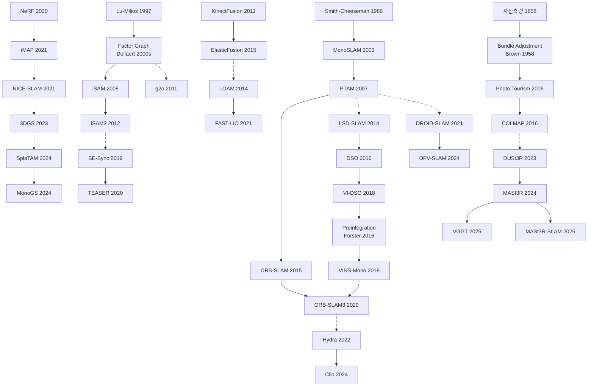

# Ch.19 — 오늘의 지도와 내일의 공란

Ch.0은 2026년의 풍경을 이렇게 묘사했다. AR 레이어가 벽에 달라붙고, 실내 배송 로봇이 지도 없이 주방과 회의실을 구분하며, DUSt3R 계열에 사진 몇 장을 던지면 수 초 안에 3D 구조가 나온다. 그 묘사는 정확하다. 그리고 이 책의 전제를 뒷받침하는 동시에 무너뜨린다.

풀린 것은 2003년의 문제다. 정적 장면, 안정된 조명, 제한된 공간, 단안 카메라의 기하학—이 가정들 위에서 EKF가 작동했고, graph SLAM이 루프를 닫았으며, ORB-SLAM이 keyframe을 관리했다. 각 답은 진짜 답이고, 각 가정은 진지하게 선택된 단순화였다.

18개 챕터의 마지막 절에는 동일한 표시가 남아 있다. 아직 열린 것들. 각 챕터가 풀었다고 선언한 자리 바로 옆에 꽂아둔 깃발들을 한 자리에 펼치는 작업이다.

---

## 19.1 조명과 환경 변화: 카메라가 감당하지 못하는 현실

Visual SLAM이 실외로 나온 순간부터 따라다닌 문제가 있다. 카메라의 측광 모델이 감당하지 못하는 조건은 현장에서 항상 먼저 도착한다.

Learned descriptor는 훈련 도메인에선 ORB를 능가하지만 underwater·thermal·low-light에서 일관성이 없고, 2026년에도 우열 합의가 없다 (Ch.2 §2.7 참조). Ch.5가 기록한 저조도·동적 추적 실패는 여전하다. 2007년 PTAM이 "Small AR Workspaces"로 스스로 범위를 제한한 이유도 대부분의 feature-based SLAM에 지금도 암묵 가정으로 남아 있다 (Ch.5 §🧭 참조).

Direct method에서 이 문제는 더 구조적이다. 밝기 보존이라는 근본 전제가 자동 노출, 역광, 터널-야외 전환에서 즉각 붕괴하고, 조명 모델을 동적으로 추정하는 완전한 해법은 없다 (Ch.8 §🧭 참조). Place recognition에서도 같은 장벽이 10년째 같은 자리다. [DINOv2](https://arxiv.org/abs/2304.07193) 기반 방법이 격차를 줄였어도, [Nordland](https://nikosuenderhauf.github.io/projects/placerecognition/)·[Oxford RobotCar](https://robotcar-dataset.robots.ox.ac.uk/)의 계절·조명 극변에서 눈 쌓인 겨울과 나뭇잎 무성한 여름을 99% 정확도로 연결하는 단일 모델은 없다 (Ch.10 §10.7 참조).

ORB-SLAM의 장기 지도 재사용도 같은 경계에 막힌다. Atlas가 멀티맵을 가능하게 했지만 아침에 만든 지도로 저녁을 인식하는 일은 조명 앞에서 실패한다 (Ch.7 §🧭 참조). Ch.2·5·7·8·10이 같은 장벽을 각자의 언어로 보고했을 뿐이다.

---

## 19.2 동적 세계 가정: 가장 오래된 단순화의 한계

정적 세계 가정은 SLAM의 가장 오래된 단순화다. 그리고 이 가정에 가장 많은 챕터가 각자의 깃발을 꽂았다.

SfM 계보에서 동적 물체는 COLMAP 포함 모든 현행 시스템의 공통 취약점이고, 2026년 기준 COLMAP 수준의 범용성을 가진 Dynamic SfM 구현체는 없다 (Ch.3 §3.7 참조). KinectFusion부터 BundleFusion까지 모두 정적 장면 전제 위에 있고, DynaSLAM·MaskFusion의 실시간 segmentation 결합 시도는 비용·robustness 모두에서 실배치 수준에 못 미친다 (Ch.9 §🧭 참조).

Monocular depth에서는 self-supervised가 moving object를 masking으로 우회하는데, 이는 푸는 것이 아니라 피하는 것이다 (Ch.11 §🧭 참조). 3DGS SLAM은 2025년에도 정적 세계 가정 위에 있고, [4DGS](https://arxiv.org/abs/2310.08528)·[Deformable 3DGS](https://arxiv.org/abs/2309.13101)가 시간 차원을 탐색 중이지만 SLAM 설정의 통합된 방식은 없다 (Ch.15 §🧭 참조). LiDAR SLAM도 면제되지 않는다. Zhang이 2014년 예견한 동적 처리 문제는 같은 자리이고, Waymo·Argo AI의 사내 솔루션은 공개 알고리즘이 아니다 (Ch.17 §🧭 참조). 다섯 챕터에서 같은 질문이 돌아오는 것은 올바른 접근법 자체가 아직 나오지 않았기 때문일 것이다.

[Ch.15b](chapter_15b_dynamic.md)가 수확한 long-term dynamic/deformable 항목도 같은 층위다. **Absence vs evidence of absence**(객체가 사라졌는가, 가려졌는가)는 [Schmid의 Panoptic Multi-TSDF](https://doi.org/10.1109/LRA.2022.3148854)(2022)가 부분 답을 냈지만 대규모 outdoor·60% 이상 occlusion에서 판정 오차가 크다. **Floating Map Ambiguity**(카메라 rigid motion과 객체 rigid motion 분리)는 isometric·visco-elastic prior로 우회될 뿐 prior 없는 식별 조건은 미해결이다. Monocular RGB에서 Khronos 수준의 change-aware 온라인 통합 시스템은 없고, 의료 MIS는 phantom·ex vivo를 넘어 실제 수술 환경에서 견고성이 떨어진다. Ch.15b의 네 항목이 여기서 다시 열린 채 남는다.

---

## 19.3 Scale과 표현 메모리: 크기가 달라지면 문제가 달라진다

SLAM 시스템이 방 한 칸에서 건물로, 건물에서 도시로 확장될 때마다 같은 질문이 새로운 형태로 돌아왔다.

Monocular scale은 1980년대 SfM 이론이 이미 증명한 기하학적 사실이고, IMU·depth로 우회될 뿐 순수 단안으로 metric scale을 유지하는 방법은 계속 형태를 바꿔 돌아온다 (Ch.5 §🧭 참조). Ch.11에서는 같은 질문이 다른 언어로 재등장한다. [Metric3D v2](https://arxiv.org/abs/2404.15506)·[Depth Anything v2](https://arxiv.org/abs/2406.09414)가 intrinsic 조건부 metric depth를 내놓았지만, intrinsic을 모르는 상황(스마트폰, CCTV, 아카이브, 위성)이 흔하고 카메라 독립적 metric depth는 foundation scale에서도 쉽지 않다 (Ch.11 §🧭 참조).

TSDF 계보에서 메모리 문제는 표현의 한계로 드러났다. [Voxblox](https://arxiv.org/abs/1611.03631)·[OctoMap](https://octomap.github.io/)이 비용을 줄였어도 건물 층·도시 블록 dense 표현은 여전히 수십 GB이고, 어느 영역에 어느 해상도를 둘지 자동 결정하는 adaptive resolution map은 범용 해법이 없다 (Ch.9 §🧭 참조). NeRF-SLAM도 같은 천장에 막혔다—도시 규모는 개방형이다 (Ch.14 §🧭 참조). Gaussian Splatting은 scene 크기에 따라 선형으로 Gaussian 수가 늘어 실내에서는 수십만, outdoor에서는 수천만에 이르고, [Compact 3DGS](https://arxiv.org/abs/2311.13681)(Lee et al. 2024) 계열의 압축이 탐색 중이지만 합의된 방법은 없다 (Ch.15 §🧭 참조). Foundation 3D에서 이 문제는 transformer의 물리적 한계로 재정의된다. 이미지 수에 quadratic한 메모리 요구가 100장에선 현실적이지만 1,000장, 10,000장은 다른 문제고, Spann3R의 incremental 방식은 부분 답이다 (Ch.16 §🧭 참조). 표현이 바뀌어도 크기의 장벽은 같은 자리에 있다.

크기 문제의 다른 얼굴은 **데이터 이동 비용**이다. 용량이 아니라 프로세서-메모리 사이 비트 이동의 물리적 비용이 전력을 먹는다. Davison은 Handbook Ch.18 §18.8에서 12번째 SLAM 지표로 "on-device data movement, measured in bits × millimetres"를 제안하며 metric을 하드웨어 공학의 언어로 재정의한다. Hierarchical scene graph가 flat voxel 대비 $O(L \cdot V/\delta^3)$에서 $O(N_\text{sub} + N_\text{obj} + N_\text{rooms})$로 압축한다는 [Hughes et al.](https://doi.org/10.15607/RSS.2022.XVIII.050)의 주장도 같은 맥락이다 (Handbook Ch.16 Eq. 16.34-16.36). Davison의 12번째 지표 재정의가 얼마나 받아들여질지는 결론이 없다.

---

## 19.4 학습 기반 시스템의 불확실성 calibration

Julier와 Uhlmann이 Ch.4에서 EKF의 inconsistency를 증명한 이래, SLAM 시스템이 "자신이 어디 있는지 모른다는 것을 얼마나 정확하게 아는가"는 이 분야의 물음으로 남아 있다.

비가우시안 불확실성은 EKF의 핵심 가정에 닿는다. 현실 센서 오류는 다중 모드·heavy-tail이 흔하고, Stein particle·normalizing flow·learned uncertainty가 시도되나 실시간 검증은 제한적이다 (Ch.4 §4.8 참조). Graph SLAM에서 robust cost function 선택도 직관에 기댄다—Huber·Cauchy·Geman-McClure 중 환경·센서에 맞는 kernel을 사전 결정하는 원칙적 방법이 없다 (Ch.6 §🧭 참조). [Ch.6b](chapter_06b_certifiable.md)의 tightness 경계도 같은 층위다. SE-Sync의 exact recovery는 노이즈 $\beta$ 이하라는 충분조건만 주고, 실제 인스턴스에서 $\beta$를 사전 계산하는 방법은 없다. Visual SLAM·VIO로 certifiable을 확장하는 문제, 새 측정이 들어올 때 SDP를 다시 풀어 certificate를 갱신하는 online certification도 열린 채 남는다.

학습 기반 방법에서 문제는 더 날카롭다. Bayesian PoseNet 실패 이후에도 learned uncertainty가 OOD 입력에서 calibrated인지는 열려 있다 (Ch.12 §🧭 참조). DROID-SLAM 계보에서 확인했듯 learned prior는 훈련 도메인 밖에서 조용히 degrade한다—geometric 실패는 명시적이지만 learned 실패는 그럴듯하다. [TartanAir](https://arxiv.org/abs/2003.14338) 같은 합성 데이터로도 sim-to-real gap이 남는다 (Ch.13 §🧭 참조).

Foundation 3D에서는 이 문제가 loop closure 재정의로 이어진다. DUSt3R 계열에서 pointmap 기반 교정 propagate는 MASt3R-SLAM이 기존 방식으로 처리하지만 원리적 해법인지는 불확실하다 (Ch.16 §🧭 참조). 자율주행·의료 로봇에서 calibrated uncertainty가 필수인데 그 수준의 시스템은 드물다.

Davison은 Handbook Ch.18에서 문제를 재정식화한다. *"100장으로 3D 모델을 만든 네트워크에 이미지 1장이 추가되면 전체를 다시 돌려야 하는가"* (p.528). 장기 표현과 fusion을 인정하는 순간 probabilistic state estimation과 modular scene representation이 필요해진다. 대안으로 제시된 [GBP Learning](https://arxiv.org/abs/2312.14294)(Nabarro et al.)은 신경망 weight를 factor graph의 random variable로 넣어 *"training time"*과 *"test time"*의 구분을 지우는 방향이다 (p.543). 이것이 원리적 답인지 문제 이관인지는 판단이 이르다.

---

## 19.5 센서 융합과 새 모달리티: 통합의 미완

Visual SLAM과 LiDAR SLAM은 같은 시기에 같은 문제를 다른 언어로 풀었다. 두 계보가 실질적으로 합쳐진 적은 없다.

LVI-SAM이 LIO-SAM에 visual odometry를 결합했지만 loosely coupled에 머물렀고, 안개·강우 같은 자율주행 필수 시나리오에서 tightly coupled 융합의 알고리즘·캘리브레이션 난이도가 여전히 장벽이다 (Ch.17 §🧭 참조). Solid-state LiDAR 보급이 가져온 알고리즘 공백도 같은 층위다. LOAM·FAST-LIO가 전제한 360° spinning과 달리 Livox·RoboSense의 비반복 스캔 패턴에는 별도 연구가 필요하고 일반화 수준이 미흡하다 (Ch.17 §🧭 참조).

Wide-baseline 매칭은 융합의 다른 각도다. 시점 변화 45도를 넘으면 Harris·ORB 성능이 급락하고, DUSt3R는 matching 자체를 회피하는 돌파구를 열었지만 이것이 descriptor 문제의 종말인지 우회인지는 판단이 이르다 (Ch.2 §2.7 참조). Place recognition과 metric localization의 통합도 파이프라인 수준의 단절이다. 두 과정을 하나의 표현으로 통합하는 2023-2025년 시도들이 있었지만 정밀도·속도를 동시에 달성한 방법은 없다 (Ch.10 §10.7 참조).

Event camera는 모달리티가 새로울 때 알고리즘이 얼마나 뒤따르는지를 보여준다. 2022년 이후 상업 고해상도 event camera가 보급되었지만 frame 기반 pipeline과의 통합, event representation, real-world benchmark가 동시 진행 중이다 (Ch.18 §🧭 참조). Kinect가 2010년 출시되고 1년 뒤 KinectFusion이 나왔던 순서와 같다.

이 책이 범위 밖으로 둔 모달리티가 있다. **4D imaging radar**와 **legged/proprioceptive SLAM**이다. Radar는 카메라·LiDAR가 안개·강우에서 동시 실패하는 조건을 보완하는 유일한 상용 센서로, Oxford Radar RobotCar(2019), NuScenes, 2023년 이후 4D imaging radar(Arbe, Mobileye)가 자율주행 주류에 진입했다. Legged SLAM은 ANYmal·Spot·Unitree의 2020년대 실외 배포와 함께 kinematic·contact prior 융합의 별도 계보를 열었다. 둘 다 visual·LiDAR·foundation 3D와 다른 원류·벤치마크를 가지며, 각자의 역사서가 필요한 크기다.

---

## 19.6 계산 구조와 하드웨어의 재결합

SLAM 역사서에 좀처럼 등장하지 않던 축이 2020년대 후반 Davison Handbook Ch.18에서 전면으로 올라왔다. 알고리즘의 그래프 구조와 실리콘의 그래프 구조를 정합시키는 문제다.

Dennard scaling 붕괴로 단일 코어 clock speed가 2000년대 중반 4GHz에서 멈춰 있고 *"this has stopped being true"* (Handbook Ch.18, p.528), 착용형 Spatial AI의 제약은 안경 한 짝—65g, <1W—으로 남아 있다. 이 간극이 **heterogeneous·specialized·parallel** 아키텍처로 분야를 밀어넣는다.

구체 실리콘 사례가 2020년대 중반에 모였다. [Apple Vision Pro R1](https://www.apple.com/apple-vision-pro/specs/)(2023)은 센서 데이터 12 ms 처리 전용 칩을 탑재하고, [Meta ARIA Gen 2](https://www.projectaria.com/ariagen2/)(2024)는 "ultra low power and on-device machine perception" custom silicon을 쓴다. [Graphcore IPU](https://www.graphcore.ai/products/ipu)는 수천 코어가 로컬 메모리와 메시지 패싱으로 연결되고, Manchester [SCAMP5](https://personalpages.manchester.ac.uk/staff/p.dudek/papers/carey-iscas2013.pdf)는 256×256 per-pixel in-plane processing을 1.2W에 처리하며, [SpiNNaker](https://apt.cs.manchester.ac.uk/projects/SpiNNaker/)는 ARM 코어 최대 100만 개의 neuromorphic 구조로 동작한다. 각자 다른 graph topology를 요구하고, 어느 실리콘에 어떻게 매핑할지에 대한 체계적 이론은 아직 없다.

이 축 위에서 Davison의 후기 track **Gaussian Belief Propagation**이 자리를 잡았다. [Ortiz et al.](https://arxiv.org/abs/2203.11618)(2022)은 IPU에서 GBP로 Bundle Adjustment를 CPU 대비 30× 가속했고, [Murai et al. Robot Web](https://arxiv.org/abs/2306.04620)(2024)은 여러 로봇이 Wi-Fi로 factor graph 조각을 공유해 asynchronous message passing으로 수렴하는 다중 로봇 SLAM을 보였다. *"We must get away from the idea that a 'god's eye view' of the whole structure of the graph will ever be available"* (Handbook Ch.18, p.541)가 이 계보의 철학이다. Factor graph를 master representation으로 두고 full posterior를 포기한 채, 메시지가 그래프 위를 "bubble"하며 국지적으로 수렴한다. 이 접근이 MASt3R-SLAM 같은 transformer 기반 시스템과 결합할지, 끝까지 다른 줄기로 남을지는 아직 답이 없다.

Davison이 제안한 12개 지표 중 11번 "power usage"와 12번 "on-device data movement"가 하드웨어 공학의 새 지표다. 정확도만큼 **전력과 이동 거리**로 평가하라는 제안이고, TUM·KITTI·EuRoC 같은 주류 벤치마크로 흡수될지는 합의가 없다. 알고리즘 중심인 이 책의 편향 바깥 영역이며, 그 편향 자체가 2020년대 후반 새로 문제화되고 있다.

---

## 19.7 Semantic 표현의 귀환과 Open-World

Semantic이 landmark 자리에서 축소됐다는 [Ch.18 §18.4](chapter_18_dead_ends.md#184-semantic-slam--object-as-landmark-경로의-축소)의 판정은 좁은 의미에서 사실이다. ORB-SLAM3도 MASt3R-SLAM도 object-level primitive를 쓰지 않는다. 그러나 같은 시기에 semantic은 **지도의 상위 layer**로 올라가 실질적 성공 궤적을 만들었다. Ch.1-18 서사에서 충분히 드러나지 않은 갈래다.

궤적은 뚜렷하다. [Kimera](https://doi.org/10.1109/ICRA40945.2020.9196885)(2020)가 metric-semantic mesh와 3D scene graph를 묶고, [Hydra](https://doi.org/10.15607/RSS.2022.XVIII.050)(2022)가 이를 실시간·계층적으로 확장했다—*"first online system to produce fully hierarchical scene graphs that included objects, places, and rooms"* (Handbook Ch.16, §16.4.2). 그 위에 foundation feature가 얹혔다. [ConceptFusion](https://arxiv.org/abs/2302.07241)·[VLMaps](https://arxiv.org/abs/2210.05714)(2023)가 CLIP을 dense map에, [ConceptGraphs](https://doi.org/10.1109/ICRA57147.2024.10610243)(2024)가 open-vocabulary object node에, [Clio](https://doi.org/10.1109/LRA.2024.3451395)(2024)가 task-driven hierarchy에, [LERF](https://arxiv.org/abs/2303.09553)·[LangSplat](https://arxiv.org/abs/2312.16084)이 radiance field와 Gaussian splatting에 CLIP을 실었다. Semantic SLAM은 죽은 것이 아니라 표현 층위를 올렸다.

그러나 이 궤적이 해결한 것보다 연 것이 더 많다. Hughes/Carlone이 꼽은 open problem은 *"performing uncertainty quantification in hierarchical representations mixing discrete and continuous variables is still a largely unexplored problem"* (p.488). object category·room ID 같은 discrete 변수와 pose·surface 같은 continuous 변수가 섞인 그래프의 불확실성 전파는 원리적 답이 없다. Outdoor·unstructured로 scene graph를 확장하는 문제도, task-driven hierarchy의 동적 재구성(Clio의 Information Bottleneck, Handbook Ch.16 Eq. 17.8)의 일반화도 열려 있다.

더 큰 질문은 "지도가 여전히 필요한가"다. Ch.17 §17.4.2 "Revisiting the Question of the Need for Maps"에서 Paull과 편집자들이 직접 다룬다. long-context VLM에 과거 프레임을 다 넣으면 explicit scene graph 없이 planning이 가능한가? [OpenEQA](https://open-eqa.github.io/)와 [Mobility VLA](https://arxiv.org/abs/2407.07775)(2024)의 결과는 map-free가 단기·단순 과제엔 작동하지만 공간·시간 지평이 길어지면 실패한다는 것이다. *"the need for an explicit map representation ... largely depend[s] on the spatial and temporal horizons of the considered tasks and remains an active area of research"* (p.515). 풀렸다는 선언도, 불필요하다는 선언도 나오지 않았다.

SLAM과 생성형 로봇 정책의 관계도 같은 지평이다. [RT-2](https://robotics-transformer2.github.io/)(2023)·[OpenVLA](https://arxiv.org/abs/2406.09246)(2024)·[π₀](https://www.physicalintelligence.company/blog/pi0)(2024) 같은 VLA 모델이 SLAM을 대체하는가, 위에 서는가. Handbook의 **마지막 문장**이 답한다. *"true generalization and scalability to compositional tasks ... could be achieved through some form of explicit structure that is learned through a process such as SLAM. ... these two paradigms ... are entirely complementary"* (Paull/Carlone, Handbook Ch.17, p.520). 527페이지가 두 계보가 서로를 필요로 한다는 한 문장으로 수렴한다. 합의에 가장 가까운 입장이지만 "complementary"가 어떤 아키텍처 결합인지는 열려 있다.

---

## 19.8 열린 질문의 구조

이 책이 추적한 18개 챕터의 열린 것들을 모아보면 패턴이 있다.

열린 문제들이 같은 방식으로 남아 있는 것은 아니다. Ch.5의 monocular scale ambiguity는 SfM 이론에서 이미 증명된 기하학적 사실이고, 2026년에도 같은 정식화로 남아 있다. 반면 동적 세계 가정은 형태를 바꾸면서 20년 동안 되돌아왔다. Ch.3의 SfM 언어로, Ch.9의 dense SLAM 언어로, Ch.15의 Gaussian 언어로, Ch.17의 LiDAR 언어로 각각 다르게 나타났다. Foundation 3D 계보에서 loop closure를 어떻게 재정의할 것인지, learned uncertainty를 어떻게 calibrate할 것인지는 2026년에 비로소 문제라는 이름을 얻었다. 그 이름을 얻은 지 몇 년 되지 않았다.

Ch.0은 SLAM이 풀렸다고 여겨지는 시대를 묘사했다. 그 묘사는 정확하다. 같은 2026년 SLAM Handbook의 Epilogue에서 편집자 5인이 공동으로 *"If someone tells you 'SLAM is solved,' don't listen to them"*이라고 적은 것도 같은 풍경을 내부에서 본 것이다. SLAM의 역사는 언제 무엇을 놓아줘야 하는지 배우는 과정이었다. 어떤 가정을 놓아주는 순간, 이전에 닫혔던 문제가 새로운 형태로 돌아온다. EKF의 선형 가정을 내려놓자 particle filter가 뒤를 이었고, sparse feature를 놓자 dense method가, geometric prior를 놓자 learned prior가 그 자리를 채웠다. 각 전환은 새로운 가정 체계로 넘어가는 일이었다.

2026년에 풀렸다고 여기는 것도 대부분 이 순환 어딘가에 있다. 지금 확신하는 가정이 흔들릴 때 공란이 다시 생긴다.

---

## 19.9 계보 약도

