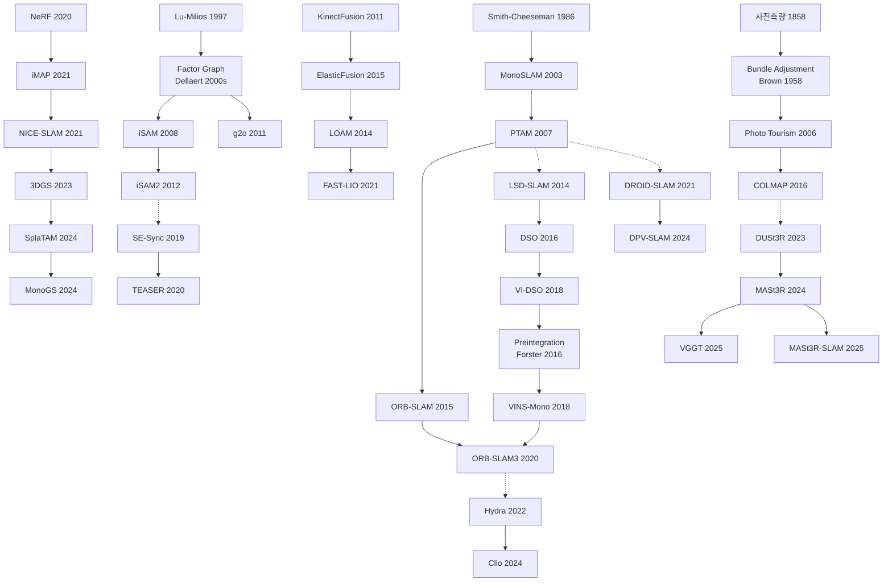

# Ch.19 — Today's Map and Tomorrow's Blanks

Ch.0 described the 2026 landscape this way. AR layers stick to the wall, indoor delivery robots tell kitchens from conference rooms without being handed a map, and a DUSt3R-family model returns 3D structure from a few photos in seconds. The description is accurate, and it both props up and undermines this book's premise.

What got solved is the 2003 problem. Static scene, stable lighting, bounded space, the geometry of a single camera — on top of those assumptions the EKF ran, graph SLAM closed loops, and ORB-SLAM managed keyframes. Each answer is a real answer, and each assumption was a simplification chosen in earnest.

The final section of each of the 18 chapters carries the same mark: the things still open. This is a harvest, not an invention — the flags planted right next to the spots where each chapter declared something solved, laid out in one place.

---

## 19.1 Lighting and environmental change: reality the camera cannot handle

A problem has trailed Visual SLAM since the moment it stepped outdoors. Conditions the camera's photometric model cannot handle show up first in the field, every time.

Learned descriptors beat ORB inside the training domain but lose consistency underwater, thermal, and low-light; as of 2026 there is still no consensus on which is more robust (see Ch.2 §2.7). The low-light and dynamic tracking failures Ch.5 recorded — the very reason 2007 PTAM bounded itself as "Small AR Workspaces" — remain the implicit assumption of most feature-based SLAM today (see Ch.5 §🧭).

In the direct-method lineage the problem is more structural. The foundational premise of brightness preservation collapses immediately under auto-exposure, strong backlight, and tunnel-to-outdoor transitions, and no full solution that dynamically estimates the lighting model has arrived (see Ch.8 §🧭). In place recognition the same barrier has sat in the same spot for over ten years. Even with [DINOv2](https://arxiv.org/abs/2304.07193)-based methods narrowing the gap, no single model links the snow-covered winter and leafy summer of [Nordland](https://nikosuenderhauf.github.io/projects/placerecognition/) and [Oxford RobotCar](https://robotcar-dataset.robots.ox.ac.uk/) at 99% accuracy (see Ch.10 §10.7).

ORB-SLAM's long-term map reuse runs into the same wall. Atlas made multi-map maintenance possible, but recognizing a morning map in the evening fails under lighting change (see Ch.7 §🧭). That Ch.2, 5, 7, 8, and 10 report the same barrier in their own languages is not accident.

---

## 19.2 Dynamic-world assumption: the oldest simplification hits its limits

The static-world assumption is SLAM's oldest simplification, and it is the assumption the most chapters planted their own flag next to.

In the SfM lineage dynamic objects are a shared weak point of every current system, COLMAP included, and as of 2026 no Dynamic SfM implementation has COLMAP-level generality (see Ch.3 §3.7). Everything in Ch.9 from KinectFusion through BundleFusion assumed a static scene, and while DynaSLAM, MaskFusion, and others coupled real-time segmentation into dense SLAM, neither cost nor robustness reached practical deployment (see Ch.9 §🧭).

In monocular depth, self-supervised methods mask out moving objects, which avoids the problem rather than solving it (see Ch.11 §🧭). 3DGS SLAM still holds the static-world assumption in 2025; [4DGS](https://arxiv.org/abs/2310.08528) and [Deformable 3DGS](https://arxiv.org/abs/2309.13101) explore a time dimension but an integrated way to represent and track dynamic objects in a SLAM setting does not exist (see Ch.15 §🧭). LiDAR SLAM is not exempt either: the dynamic-object problem Zhang anticipated in 2014 sits in the same spot, and the in-house solutions of Waymo and Argo AI are not publicly available general algorithms (see Ch.17 §🧭). That the same question comes back across five chapters probably means the right approach itself has not appeared yet.

The long-term dynamic and deformable items harvested in [Ch.15b](chapter_15b_dynamic.md) sit on the same layer. **Absence vs evidence of absence** (did an object vanish or was it occluded) got a partial answer in [Schmid's Panoptic Multi-TSDF](https://doi.org/10.1109/LRA.2022.3148854) (2022) but misjudgment is large in large-scale outdoor and occlusion above 60%. **Floating Map Ambiguity** (separating camera rigid motion from object rigid motion) is only skirted with isometric and visco-elastic priors; identification conditions without a prior are unresolved. No system runs Khronos-level change-aware integration online from monocular RGB, and medical MIS degrades beyond phantom and ex vivo into actual surgical conditions. All four items from Ch.15b remain open here.

---

## 19.3 Scale and representational memory: the problem changes when the size does

Every time a SLAM system expanded from one room to a building, and from a building to a city, the same question came back in a new form.

Monocular scale is a geometric fact already proven in 1980s SfM theory; IMUs and depth sensors route around it, but a pure monocular method for holding metric scale keeps returning in shifted form (see Ch.5 §🧭). In Ch.11 the same question appears in another language. [Metric3D v2](https://arxiv.org/abs/2404.15506) and [Depth Anything v2](https://arxiv.org/abs/2406.09414) produce metric depth conditional on intrinsics, but the intrinsics-unknown case (smartphones, CCTV, archives, satellites) is common, and camera-independent metric depth is not easy even at foundation scale (see Ch.11 §🧭).

In the TSDF lineage the memory problem surfaced as a limit of the representation. [Voxblox](https://arxiv.org/abs/1611.03631) and [OctoMap](https://octomap.github.io/) reduced cost, but building-floor and city-block dense representation is still tens of gigabytes, and an adaptive-resolution map has no general-purpose solution (see Ch.9 §🧭). NeRF-SLAM hit the same ceiling — city-scale is open (see Ch.14 §🧭). In Gaussian Splatting the Gaussian count rises linearly with scene size, indoor hundreds of thousands becoming outdoor tens of millions, and the [Compact 3DGS](https://arxiv.org/abs/2311.13681) (Lee et al. 2024) family is exploring compression without agreement (see Ch.15 §🧭). In foundation 3D the problem is redefined as a physical limit of the transformer: memory quadratic in image count is realistic at 100 but a different problem at 1,000 or 10,000, and Spann3R's incremental approach is only partial (see Ch.16 §🧭). Even as the representation changes, the barrier of size sits in the same spot.

The other face of the size problem is **data movement cost** — not representational capacity but the physical cost of pushing bits between processor and memory, which drains power. In Handbook Ch.18 §18.8 Davison proposes "on-device data movement, measured in bits × millimetres" as the 12th SLAM performance metric, redefining a SLAM metric in the language of a hardware engineer. [Hughes et al.'s claim](https://doi.org/10.15607/RSS.2022.XVIII.050) that hierarchical scene graph compresses memory from $O(L \cdot V/\delta^3)$ to $O(N_\text{sub} + N_\text{obj} + N_\text{rooms})$ sits in the same register (Handbook Ch.16 Eq. 16.34-16.36). Whether this redefinition will be broadly accepted is without verdict.

---

## 19.4 Uncertainty calibration for learning-based systems

Since Julier and Uhlmann proved the inconsistency of the EKF in Ch.4, the question of how accurately a SLAM system knows that it does not know where it is has remained the field's question.

Non-Gaussian uncertainty touches the core assumption of the EKF. Real sensor errors are often multimodal or heavy-tailed; Stein particles, normalizing flows, and learned uncertainty are being tried, but real-time validation is limited (see Ch.4 §4.8). In graph SLAM robust cost function selection still leans on intuition — no principled method decides in advance which of Huber, Cauchy, or Geman-McClure fits a given environment and sensor (see Ch.6 §🧭). The tightness bounds of [Ch.6b](chapter_06b_certifiable.md) sit on the same layer. SE-Sync's exact recovery theorem gave the sufficient condition "noise below $\beta$" with no way to compute $\beta$ in advance on an actual instance. Extending the certifiable framework to Visual SLAM and VIO, and online certification that re-solves the SDP as new measurements come in, also sit open.

In learning-based methods the problem returns sharper. After Bayesian PoseNet's failure, how calibrated a learned uncertainty estimate is under OOD input remains open (see Ch.12 §🧭). As the DROID-SLAM lineage confirmed, learned priors silently degrade outside the training domain — geometric failure is explicit, learned failure is plausible. [TartanAir](https://arxiv.org/abs/2003.14338)-style synthetic training still leaves a sim-to-real gap (see Ch.13 §🧭).

In foundation 3D the same problem redefines loop closure. Propagating correction in a pointmap-based map — MASt3R-SLAM handles it with existing methods, but whether that is a principled solution is unknown (see Ch.16 §🧭). In autonomous driving and medical robotics calibrated uncertainty is required, but few systems treat it at that level.

Davison reformulates this. *"If a network has built a 3D model from 100 images, does adding one more image require running the whole thing again"* (Handbook Ch.18, p.528). The moment one admits long-term representation and fusion are needed, probabilistic state estimation and modular scene representation become necessary. The [GBP Learning](https://arxiv.org/abs/2312.14294) lineage (Nabarro et al.) puts network weights as random variables of a factor graph, erasing the divide between *"training time"* and *"test time"* (p.543). Whether this is the principled answer or a transfer into another assumption system is too early to judge.

---

## 19.5 Sensor fusion and new modalities: integration unfinished

Visual SLAM and LiDAR SLAM solved the same problem in different languages at the same time. The two lineages have never substantively merged.

LVI-SAM coupled visual odometry into LIO-SAM but only at loosely-coupled level; scenarios where cameras fail in fog and rain and LiDAR must take over are a clear autonomous-driving requirement, yet the algorithmic and calibration difficulty of tightly coupled fusion remains a barrier (see Ch.17 §🧭). The algorithmic gap from solid-state LiDAR sits on the same layer — LOAM and FAST-LIO presume 360° spinning, and the non-repetitive scan patterns of Livox and RoboSense need separate research without adequate generalization (see Ch.17 §🧭).

Wide-baseline matching is another angle on modality fusion. Past 45 degrees of viewpoint change Harris- and ORB-based matching drops sharply, and DUSt3R opened a breakthrough by avoiding matching itself, but whether this is the end of the descriptor problem or a bypass is too early to judge (see Ch.2 §2.7). The integration between place recognition and metric localization is a pipeline-level disconnect; 2023-2025 attempts to unify them into a single representation exist but none achieves both precision and speed (see Ch.10 §10.7).

Event cameras show how far algorithms lag when a modality is new. Commercial high-resolution event cameras spread after 2022, but integration with frame-based pipelines, new event representations, and real-world benchmarks are all underway simultaneously (see Ch.18 §🧭). The same sequence as Kinect launching in 2010 and KinectFusion arriving a year later.

There are modalities this book left out of scope: **4D imaging radar** and **legged/proprioceptive SLAM**. Radar is the only commercial sensor covering conditions where camera and LiDAR both fail in fog and rain — Oxford Radar RobotCar (2019), NuScenes' radar channel, and 4D imaging radar (Arbe, Mobileye) after 2023 entered the mainstream of autonomous-driving research. Legged SLAM opened a separate lineage fusing kinematic and contact priors with outdoor deployment of ANYmal, Spot, and Unitree in the 2020s. Both have different origins and benchmarks from the visual, LiDAR, and foundation-3D lineages, and each is a size that needs its own history.

---

## 19.6 Recoupling compute structure and hardware

An axis that rarely appeared in SLAM histories came to the front in Davison's Handbook Ch.18 in the late 2020s: matching the graph structure of the algorithm to the graph structure of the silicon.

Dennard scaling broke, single-core CPU clock speed stopped near 4GHz in the mid-2000s and *"this has stopped being true"* (Handbook Ch.18, p.528), while the constraint of wearable Spatial AI stays at one pair of glasses — 65g, <1W. That gap pushes the field into a **heterogeneous, specialized, parallel** architecture.

Concrete silicon cases gathered in the mid-2020s. [Apple Vision Pro R1](https://www.apple.com/apple-vision-pro/specs/) (2023) is a dedicated chip for 12 ms sensor processing, [Meta ARIA Gen 2](https://www.projectaria.com/ariagen2/) (2024) carries "ultra low power and on-device machine perception" custom silicon, the [Graphcore IPU](https://www.graphcore.ai/products/ipu) has thousands of independent cores with local memory communicating by message passing, Manchester's [SCAMP5](https://personalpages.manchester.ac.uk/staff/p.dudek/papers/carey-iscas2013.pdf) implements 256×256 per-pixel in-plane processing at 1.2W, and [SpiNNaker](https://apt.cs.manchester.ac.uk/projects/SpiNNaker/) ties up to one million ARM cores in a neuromorphic structure. Each demands a different graph topology, and there is no systematic theory yet for how to map Spatial AI algorithms onto which silicon.

On this axis Davison's later track — **Gaussian Belief Propagation** — found its place. [Ortiz et al.](https://arxiv.org/abs/2203.11618) (2022) accelerated bundle adjustment on the IPU with GBP by 30× over CPU, and [Murai et al. Robot Web](https://arxiv.org/abs/2306.04620) (2024) showed multi-robot SLAM where robots share factor graph fragments over Wi-Fi and converge through asynchronous message passing. *"We must get away from the idea that a 'god's eye view' of the whole structure of the graph will ever be available"* (Handbook Ch.18, p.541) is the philosophy. Take the factor graph as master representation, give up full-posterior computation, and let messages "bubble" over the graph, converging locally. Whether this approach combines with transformer-based systems like MASt3R-SLAM or remains a separate stem is still unanswered.

Of Davison's twelve metrics, number 11 "power usage" and number 12 "on-device data movement" are the new ones in the language of hardware engineering — a proposal to evaluate by **power and distance traveled** as much as by accuracy. Whether this will be absorbed into mainstream benchmarks like TUM, KITTI, and EuRoC is without consensus. It is an area outside the algorithm-centered bias of this book, and that bias itself is being newly problematized in the late 2020s.

---

## 19.7 The return of semantic representation and Open-World

The verdict that semantics shrank out of SLAM's landmark slot ([Ch.18 §18.4](chapter_18_dead_ends.md#184-semantic-slam--the-shrinking-of-the-object-as-landmark-path)) is true in the narrow sense. Neither ORB-SLAM3 nor MASt3R-SLAM uses object-level primitives. But over the same period semantics rose onto an **upper layer of the map** and built a trajectory of real success — a path the Ch.1-18 narrative does not fully surface.

The trajectory is clear. [Kimera](https://doi.org/10.1109/ICRA40945.2020.9196885) (2020) bundled metric-semantic mesh and 3D scene graph, and [Hydra](https://doi.org/10.15607/RSS.2022.XVIII.050) (2022) extended it in real time and hierarchically — *"first online system to produce fully hierarchical scene graphs that included objects, places, and rooms"* (Handbook Ch.16, §16.4.2). Foundation features sat on top. [ConceptFusion](https://arxiv.org/abs/2302.07241) and [VLMaps](https://arxiv.org/abs/2210.05714) (2023) put CLIP into a dense map, [ConceptGraphs](https://doi.org/10.1109/ICRA57147.2024.10610243) (2024) into open-vocabulary object nodes, [Clio](https://doi.org/10.1109/LRA.2024.3451395) (2024) into task-driven hierarchy, and [LERF](https://arxiv.org/abs/2303.09553) and [LangSplat](https://arxiv.org/abs/2312.16084) into radiance fields and Gaussian splatting. Semantic SLAM did not die; it raised its representational layer.

But this trajectory opened more than it resolved. Hughes/Carlone's picked open problem is *"performing uncertainty quantification in hierarchical representations mixing discrete and continuous variables is still a largely unexplored problem"* (p.488). When discrete variables like object category and room ID mix with continuous ones like pose and surface in the same graph, how to propagate uncertainty has no principled answer. Extending scene graphs into outdoor and unstructured environments is also open, and dynamically reconfiguring task-driven hierarchy (Clio's Information Bottleneck, Handbook Ch.16 Eq. 17.8) lacks generalization.

A larger question is "do we still need a map". Paull and the editors take it up directly in Ch.17 §17.4.2 "Revisiting the Question of the Need for Maps". If one feeds every past frame into a long-context VLM, is planning possible without an explicit scene graph? [OpenEQA](https://open-eqa.github.io/) and [Mobility VLA](https://arxiv.org/abs/2407.07775) (2024) show map-free works on short and simple tasks but fails as spatial and temporal horizons lengthen. *"the need for an explicit map representation ... largely depend[s] on the spatial and temporal horizons of the considered tasks and remains an active area of research"* (p.515). Neither a declaration of solved nor of unneeded has come.

The relation of SLAM to generative robot policies sits open on the same horizon. Do VLA models like [RT-2](https://robotics-transformer2.github.io/) (2023), [OpenVLA](https://arxiv.org/abs/2406.09246) (2024), and [π₀](https://www.physicalintelligence.company/blog/pi0) (2024) replace SLAM, or sit on top of it. The **final sentence** of the whole Handbook answers. *"true generalization and scalability to compositional tasks ... could be achieved through some form of explicit structure that is learned through a process such as SLAM. ... these two paradigms ... are entirely complementary"* (Paull/Carlone, Handbook Ch.17, p.520). 527 pages converge into one sentence declaring the two lineages need each other — the position closest to consensus, but what architectural combination "complementary" means is still open.

---

## 19.8 The shape of the open questions

Gathering the open items this book has tracked across 18 chapters reveals a pattern.

The open problems are not all open in the same way. The monocular scale ambiguity of Ch.5 is a geometric fact already proven in SfM theory, and it stays in the same formulation in 2026. The dynamic-world assumption, in contrast, has come back in shifting forms over twenty years. It appeared differently in the SfM language of Ch.3, the dense-SLAM language of Ch.9, the Gaussian language of Ch.15, and the LiDAR language of Ch.17. How to redefine loop closure in the foundation-3D lineage, and how to calibrate learned uncertainty, only earned the name of problem in 2026. They have been named for only a few years.

Ch.0 described the era in which SLAM is taken to be solved. The description is accurate. That the five editors of the 2026 SLAM Handbook wrote jointly in the Epilogue *"If someone tells you 'SLAM is solved,' don't listen to them"* is the same landscape seen from inside. The history of SLAM is not a history of stacking up new things but a history of learning when to let go of what. The moment one assumption is released, a problem previously closed returns in new form. When the EKF's linearity assumption was set down particle filters followed, and when sparse features were set down dense methods came in, each transition moving into a new assumption system rather than discarding the earlier method.

What is taken as solved in 2026 also sits somewhere inside this cycle. When the assumption now held with confidence begins to shake, the blanks open again.

---

## 19.9 Lineage map

