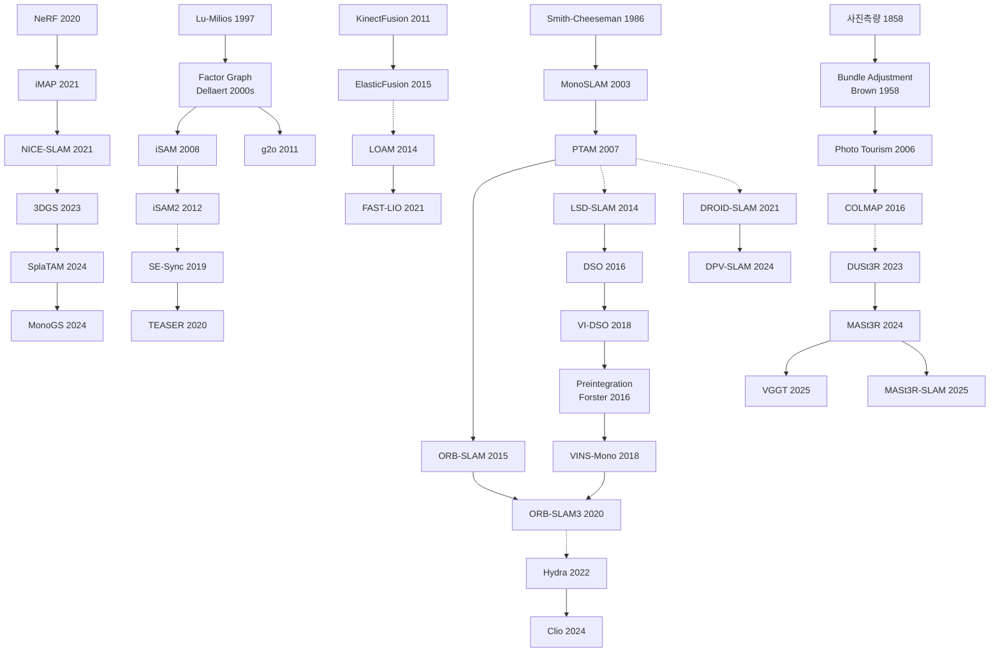

# Ch.19 — Today's Map and Tomorrow's Open Questions

By 2026, AR layers remained fixed to walls, indoor delivery robots distinguished kitchens from conference rooms without a supplied map, and DUSt3R-family models recovered 3D structure from a few photographs in seconds. These systems solved many of the problems that defined SLAM in 2003, but only under particular assumptions.

The 2003 formulation assumed a static scene, stable lighting, bounded space, and the geometry of a single camera. Under those conditions, the EKF tracked state, graph SLAM closed loops, and ORB-SLAM managed keyframes. The solutions remain valid within the simplifying assumptions on which they were built.

Across the preceding chapters, the unresolved problems recur beside the conditions under which individual methods succeed. Collected together, they reveal where apparently separate lineages face the same constraints.

---

## 19.1 Lighting and environmental change: reality the camera cannot handle

Visual SLAM has struggled with environmental change since its first outdoor deployments. Field conditions repeatedly expose the limits of a camera's photometric model.

Learned descriptors beat ORB inside the training domain but lose consistency on underwater, thermal, and low-light imagery; as of 2026 there is still no consensus on which is more robust (see Ch.2 §2.7). The low-light and dynamic-tracking failures recorded in Ch.5 explain why the 2007 PTAM paper bounded itself as "Small AR Workspaces." Most feature-based SLAM still assumes more stable conditions (see Ch.5 §🧭).

The direct-method lineage faces a structural version of the problem. Brightness preservation fails under auto-exposure, strong backlight, and tunnel-to-outdoor transitions, and no complete method dynamically estimates the lighting model (see Ch.8 §🧭). Place recognition has faced a related limit for more than ten years. Even with [DINOv2](https://arxiv.org/abs/2304.07193)-based methods narrowing the gap, a single model does not yet maintain consistent precision and recall across the extreme seasonal and lighting conditions in [Nordland](https://nikosuenderhauf.github.io/projects/placerecognition/) and [Oxford RobotCar](https://robotcar-dataset.robots.ox.ac.uk/) (see Ch.10 §10.7).

ORB-SLAM's long-term map reuse has the same limitation. Atlas made multi-map maintenance possible, but lighting changes can prevent recognition of the same place between morning and evening (see Ch.7 §🧭). Ch.2, 5, 7, 8, and 10 each encounter this problem through a different component of the pipeline.

---

## 19.2 Dynamic-world assumption: the oldest simplification hits its limits

The static-world assumption is one of SLAM's oldest simplifications and recurs across more lineages than any other.

In the SfM lineage dynamic objects are a shared weak point of every current system, COLMAP included, and as of 2026 no Dynamic SfM implementation has COLMAP-level generality (see Ch.3 §3.7). Everything in Ch.9 from KinectFusion through BundleFusion assumed a static scene, and while DynaSLAM, MaskFusion, and others coupled real-time segmentation into dense SLAM, neither cost nor robustness reached practical deployment (see Ch.9 §🧭).

In monocular depth, self-supervised methods mask moving objects, avoiding rather than solving the problem (see Ch.11 §🧭). 3DGS SLAM still assumed a static world in 2025. [4DGS](https://arxiv.org/abs/2310.08528) and [Deformable 3DGS](https://arxiv.org/abs/2309.13101) add a time dimension, but no integrated SLAM system both represents and tracks dynamic objects (see Ch.15 §🧭). LiDAR SLAM is not exempt: the dynamic-object problem Zhang anticipated in 2014 remains, while production autonomous-driving stacks are largely proprietary and difficult to compare directly with public research systems (see Ch.17 §🧭). Five chapters reach the same unresolved problem through different representations.

The long-term dynamic and deformable problems in [Ch.15b](chapter_15b_dynamic.md) are related. **Absence vs evidence of absence**, whether an object vanished or was occluded, received a partial answer through the active submaps of [Schmid's Panoptic Multi-TSDF](https://doi.org/10.1109/LRA.2022.3148854) (2022). The Handbook treats occlusion above 70% as an extreme-environment case that remains difficult, but does not report it as a universal error threshold for Panoptic Multi-TSDF. **Floating Map Ambiguity**, separating rigid camera motion from rigid object motion, is constrained only through isometric and visco-elastic priors; identification without a prior remains unresolved. No system performs Khronos-level change-aware integration online from monocular RGB, and medical MIS systems lose robustness when moving from phantom and ex vivo data to surgical conditions. All four items from Ch.15b remain open.

---

## 19.3 Scale and representational memory: the problem changes when the size does

Scaling a SLAM system from one room to a building, and from a building to a city, exposes related limits in several representations.

Monocular scale is a geometric ambiguity established in 1980s SfM theory. Without an IMU, depth sensor, or another metric cue, projective geometry in monocular imagery alone cannot determine the metric scale of the trajectory and scene (see Ch.5 §🧭). [Metric3D v2](https://arxiv.org/abs/2404.15506) and [Depth Anything v2](https://arxiv.org/abs/2406.09414) produce metric depth when camera intrinsics are known, yet smartphones, CCTV footage, archives, and satellite imagery often lack them. Foundation-scale training has not removed this constraint (see Ch.11 §🧭).

In the TSDF lineage, memory became a limit of the representation. [Voxblox](https://arxiv.org/abs/1611.03631) and [OctoMap](https://octomap.github.io/) reduced the cost, but memory for a dense representation still rises rapidly with mapped volume and voxel resolution, and no general adaptive-resolution policy has been established (see Ch.9 §🧭). NeRF-SLAM also remains open at city scale (see Ch.14 §🧭). In Gaussian Splatting, the required number of Gaussians rises with scene extent and detail; the [Compact 3DGS](https://arxiv.org/abs/2311.13681) (Lee et al. 2024) family explores compression, but no approach has become standard (see Ch.15 §🧭). Foundation 3D moves the limit into the transformer: attention across all image tokens has quadratic memory cost in the token count, making long sequences difficult, and Spann3R provides only a partial incremental solution (see Ch.16 §🧭). The representations differ, but each reaches a scale-dependent memory limit.

Scale also raises **data movement cost**, the energy needed to move bits between processor and memory rather than the capacity of the representation alone. In Handbook Ch.18 §18.8, Davison proposes "on-device data movement, measured in bits × millimetres" as the 12th SLAM performance metric. [Hughes et al.](https://doi.org/10.15607/RSS.2022.XVIII.050) likewise describe how a hierarchical scene graph reduces memory from $O(L \cdot V/\delta^3)$ to $O(N_\text{sub} + N_\text{obj} + N_\text{rooms})$ (Handbook Ch.16 Eq. 16.34-16.36). It remains unclear whether mainstream evaluations will adopt data movement as a metric.

---

## 19.4 Uncertainty calibration for learning-based systems

Since Julier and Uhlmann established the EKF's inconsistency in Ch.4, SLAM researchers have had to ask whether a system's reported uncertainty matches its actual localization error.

Non-Gaussian uncertainty violates a central EKF assumption. Real sensor errors are often multimodal or heavy-tailed; Stein particles, normalizing flows, and learned uncertainty have been tested, but their real-time validation remains limited (see Ch.4 §4.8). In graph SLAM, robust-cost selection still relies heavily on judgment because no principled method determines in advance whether Huber, Cauchy, or Geman-McClure fits a particular sensor and environment (see Ch.6 §🧭). [Ch.6b](chapter_06b_certifiable.md) raises a related issue of tightness bounds. SE-Sync's exact-recovery theorem gives the sufficient condition "noise below $\beta$" without a way to compute $\beta$ in advance for an actual instance. Extending certifiable methods to Visual SLAM and VIO, and re-solving the SDP online as measurements arrive, also remain open.

Learning-based methods make the calibration problem harder to observe. After Bayesian PoseNet, uncertainty under out-of-distribution input remained unresolved (see Ch.12 §🧭). DROID-SLAM and related systems showed that learned priors can degrade outside the training domain without an explicit failure signal. [TartanAir](https://arxiv.org/abs/2003.14338)-style synthetic training still leaves a sim-to-real gap (see Ch.13 §🧭).

Foundation 3D adds the question of how to propagate a loop-closure correction through a pointmap. MASt3R-SLAM uses existing methods, but whether this is a principled solution is unknown (see Ch.16 §🧭). Autonomous driving and medical robotics need calibrated uncertainty, yet few systems address it at that level.

Davison frames the issue with a question: *"If a network has built a 3D model from 100 images, does adding one more image require running the whole thing again"* (Handbook Ch.18, p.528). Long-term representation and fusion bring probabilistic state estimation and modular scene representations back into the system. The [GBP Learning](https://arxiv.org/abs/2312.14294) lineage (Nabarro et al.) represents network weights as random variables in a factor graph, reducing the distinction between *"training time"* and *"test time"* (p.543). Whether this formulation resolves the problem or moves it into another set of assumptions remains unclear.

---

## 19.5 Sensor fusion and new modalities: integration unfinished

Visual SLAM and LiDAR SLAM addressed localization and mapping with different measurements and algorithms. Their lineages have not yet merged into a common architecture.

LVI-SAM coupled visual odometry with LIO-SAM, but largely at a loosely coupled level. Autonomous-driving systems need LiDAR to take over when cameras fail in fog or rain, yet tightly coupled fusion remains difficult both algorithmically and in calibration (see Ch.17 §🧭). Solid-state LiDAR poses a related problem. Limited fields of view and non-repetitive patterns differ from the original LOAM's 360° scan-line assumptions. FAST-LIO2 and Livox LOAM address parts of this setting, but generalization across sensor families remains limited (see Ch.17 §🧭).

Wide-baseline matching presents a related integration problem. Beyond 45 degrees of viewpoint change, Harris- and ORB-based matching drops sharply. DUSt3R bypasses explicit matching, but it is too early to know whether this resolves the descriptor problem or avoids it temporarily (see Ch.2 §2.7). Place recognition and metric localization also remain separate pipeline stages. Attempts from 2023–2025 to unify them in one representation achieved neither the required precision nor speed (see Ch.10 §10.7).

Event cameras show the lag between new hardware and mature algorithms. Commercial high-resolution event cameras spread after 2022, while integration with frame-based pipelines, event representations, and real-world benchmarks all remained under development (see Ch.18 §🧭). Kinect followed a similar sequence: the sensor launched in 2010 and KinectFusion arrived a year later.

Two modalities fall outside this account: **4D imaging radar** and **legged/proprioceptive SLAM**. Radar can complement cameras and LiDAR in conditions such as fog and rain, where both optical modalities may degrade. Oxford Radar RobotCar (2019), the radar channel in NuScenes, and 4D imaging radar development by companies including Arbe and Mobileye broadened this modality's role in autonomous-driving research and products. Legged SLAM formed a separate lineage that fused kinematic and contact priors for outdoor deployment of ANYmal, Spot, and Unitree in the 2020s. Both have distinct origins and benchmarks from the visual, LiDAR, and foundation-3D lineages and warrant separate histories.

---

## 19.6 Recoupling compute structure and hardware

Davison's Handbook Ch.18 emphasizes a topic rarely covered in SLAM histories: matching the graph structure of an algorithm to the graph structure of the silicon.

Dennard scaling broke, and single-core CPU clock speed stalled near 4 GHz in the mid-2000s; *"this has stopped being true"* (Handbook Ch.18, p.528). Wearable Spatial AI still has to fit into glasses weighing 65 g and consuming less than 1 W. The gap favors heterogeneous, specialized, parallel hardware.

Several hardware examples appeared by the mid-2020s. [Apple Vision Pro R1](https://www.apple.com/apple-vision-pro/specs/) (2023) is a dedicated chip for 12 ms sensor processing; [Meta ARIA Gen 2](https://www.projectaria.com/ariagen2/) (2024) carries custom silicon for "ultra low power and on-device machine perception." The [Graphcore IPU](https://www.graphcore.ai/products/ipu) has thousands of independent cores with local memory communicating by message passing. Manchester's [SCAMP5](https://personalpages.manchester.ac.uk/staff/p.dudek/papers/carey-iscas2013.pdf) implements 256×256 per-pixel in-plane processing at 1.2 W, while [SpiNNaker](https://apt.cs.manchester.ac.uk/projects/SpiNNaker/) connects up to one million ARM cores in a neuromorphic structure. Each supports a different graph topology, and no systematic theory maps Spatial AI algorithms to these architectures.

Davison's later work on **Gaussian Belief Propagation** addresses this hardware structure. [Ortiz et al.](https://arxiv.org/abs/2203.11618) (2022) accelerated bundle adjustment on the IPU with GBP by 30× over a CPU, and [Murai et al. Robot Web](https://arxiv.org/abs/2306.04620) (2024) demonstrated multi-robot SLAM in which robots shared factor-graph fragments over Wi-Fi and converged through asynchronous message passing. The motivation was that *"we must get away from the idea that a 'god's eye view' of the whole structure of the graph will ever be available"* (Handbook Ch.18, p.541). The factor graph becomes the main representation, and local messages replace full-posterior computation. Whether this approach will combine with transformer-based systems such as MASt3R-SLAM remains unanswered.

Among Davison's twelve metrics, number 11 is "power usage" and number 12 is "on-device data movement." Both extend evaluation beyond accuracy to the power and physical distance involved in computation. TUM, KITTI, and EuRoC do not yet include these measures, and no consensus exists on how to add them to mainstream benchmarks.

---

## 19.7 The return of semantic representation and Open-World

Semantic objects did recede from SLAM's landmark representation, as [Ch.18 §18.4](chapter_18_dead_ends.md#184-semantic-slam--the-shrinking-of-the-object-as-landmark-path) describes. Neither ORB-SLAM3 nor MASt3R-SLAM uses object-level primitives. Over the same period, however, semantics moved to an upper layer of the map and produced practical systems.

[Kimera](https://doi.org/10.1109/ICRA40945.2020.9196885) (2020) combined a metric-semantic mesh with a 3D scene graph, and [Hydra](https://doi.org/10.15607/RSS.2022.XVIII.050) (2022) extended it into the *"first online system to produce fully hierarchical scene graphs that included objects, places, and rooms"* (Handbook Ch.16, §16.4.2). Foundation features were then added to this layer. [ConceptFusion](https://arxiv.org/abs/2302.07241) and [VLMaps](https://arxiv.org/abs/2210.05714) (2023) placed CLIP features in dense maps; [ConceptGraphs](https://doi.org/10.1109/ICRA57147.2024.10610243) (2024) used open-vocabulary object nodes; [Clio](https://doi.org/10.1109/LRA.2024.3451395) (2024) built task-driven hierarchies; and [LERF](https://arxiv.org/abs/2303.09553) and [LangSplat](https://arxiv.org/abs/2312.16084) attached language to radiance fields and Gaussian splatting. Semantic representation persisted above the geometric map rather than as its landmarks.

This work introduced unresolved questions of its own. Hughes and Carlone identify one directly: *"performing uncertainty quantification in hierarchical representations mixing discrete and continuous variables is still a largely unexplored problem"* (p.488). No principled method propagates uncertainty when discrete variables such as object category and room ID share a graph with continuous variables such as pose and surface. Scene graphs also remain difficult to extend into outdoor and unstructured environments, while Clio's task-driven hierarchy (Handbook Ch.16 Eq. 17.8) has not generalized broadly.

A broader question is whether a system still needs an explicit map. Paull and the editors address it in Ch.17 §17.4.2, "Revisiting the Question of the Need for Maps." A long-context VLM might plan from past frames without an explicit scene graph. [OpenEQA](https://open-eqa.github.io/) and [Mobility VLA](https://arxiv.org/abs/2407.07775) (2024) show that map-free methods work on short, simple tasks but degrade as spatial and temporal horizons lengthen. *"the need for an explicit map representation ... largely depend[s] on the spatial and temporal horizons of the considered tasks and remains an active area of research"* (p.515). The evidence supports neither universal map use nor universal map-free operation.

The relation between SLAM and generative robot policies raises the same question. VLA models such as [RT-2](https://robotics-transformer2.github.io/) (2023), [OpenVLA](https://arxiv.org/abs/2406.09246) (2024), and [π₀](https://www.physicalintelligence.company/blog/pi0) (2024) might replace SLAM or operate above it. The Handbook's final sentence argues that *"true generalization and scalability to compositional tasks ... could be achieved through some form of explicit structure that is learned through a process such as SLAM. ... these two paradigms ... are entirely complementary"* (Paull/Carlone, Handbook Ch.17, p.520). The architecture implied by "complementary" remains open.

---

## 19.8 The shape of the open questions

The open problems differ in both age and kind.

The monocular scale ambiguity of Ch.5 is a geometric fact established in SfM theory and retains the same formulation in 2026. The dynamic-world assumption, by contrast, has returned in changing forms over twenty years: SfM in Ch.3, dense SLAM in Ch.9, Gaussian maps in Ch.15, and LiDAR in Ch.17. Loop closure for foundation 3D and calibration of learned uncertainty are newer formulations that emerged only in the preceding few years.

Ch.0 described a period in which SLAM is often treated as solved. The five editors of the 2026 SLAM Handbook offer the internal counterpoint in their epilogue: *"If someone tells you 'SLAM is solved,' don't listen to them."* New methods repeatedly relax one assumption and expose another problem. Particle filters addressed limits in the EKF's linearization, while dense methods retained image information discarded by sparse features. Neither transition invalidated the earlier method; each changed the assumptions under which the system operated.

Methods regarded as solved in 2026 remain conditional in the same way. Their next open problem will appear when one of those conditions no longer holds.

---

## 19.9 Lineage map

```mermaid
graph TD
  PM[사진측량 1858]
  BA[Bundle Adjustment<br/>Brown 1958]
  SfM[Photo Tourism 2006]
  COLMAP[COLMAP 2016]

  SC[Smith-Cheeseman 1986]
  Mono[MonoSLAM 2003]
  PTAM[PTAM 2007]
  ORB[ORB-SLAM 2015]
  ORB3[ORB-SLAM3 2020]

  LSD[LSD-SLAM 2014]
  DSO[DSO 2016]
  VIDSO[VI-DSO 2018]

  LM[Lu-Milios 1997]
  FG[Factor Graph<br/>Dellaert 2000s]
  iSAM[iSAM 2008]
  iSAM2[iSAM2 2012]
  g2o[g2o 2011]

  Forster[Preintegration<br/>Forster 2016]
  VINS[VINS-Mono 2018]

  Kinect[KinectFusion 2011]
  Elastic[ElasticFusion 2015]

  SESync[SE-Sync 2019]
  TEASER[TEASER 2020]

  LOAM[LOAM 2014]
  FAST[FAST-LIO 2021]

  NeRF[NeRF 2020]
  iMAP[iMAP 2021]
  NICE[NICE-SLAM 2021]

  GS3D[3DGS 2023]
  Spla[SplaTAM 2024]
  MonoGS[MonoGS 2024]

  DROID[DROID-SLAM 2021]
  DPV[DPV-SLAM 2024]

  DUSt3R[DUSt3R 2023]
  MASt[MASt3R 2024]
  VGGT[VGGT 2025]
  MASlam[MASt3R-SLAM 2025]

  Hydra[Hydra 2022]
  Clio[Clio 2024]

  PM --> BA --> SfM --> COLMAP
  SC --> Mono --> PTAM --> ORB --> ORB3
  PTAM -.-> LSD --> DSO --> VIDSO
  LM --> FG --> iSAM --> iSAM2
  FG --> g2o
  iSAM2 -.-> SESync --> TEASER
  Forster --> VINS --> ORB3
  VIDSO --> Forster
  Kinect --> Elastic
  Elastic -.-> LOAM --> FAST
  NeRF --> iMAP --> NICE
  NICE -.-> GS3D --> Spla --> MonoGS
  PTAM -.-> DROID --> DPV
  COLMAP -.-> DUSt3R --> MASt --> VGGT
  MASt --> MASlam
  ORB3 -.-> Hydra --> Clio

  click PM "#chapter-1" "Ch.1 Prehistory — Photogrammetry"
  click BA "#chapter-1" "Ch.1 Prehistory — Bundle Adjustment"
  click SfM "#chapter-3" "Ch.3 Structure from Motion"
  click COLMAP "#chapter-3" "Ch.3 SfM — COLMAP"
  click SC "#chapter-4" "Ch.4 EKF-SLAM — Smith-Cheeseman"
  click Mono "#chapter-5" "Ch.5 MonoSLAM·PTAM"
  click PTAM "#chapter-5" "Ch.5 MonoSLAM·PTAM"
  click ORB "#chapter-7" "Ch.7 ORB-SLAM family"
  click ORB3 "#chapter-7" "Ch.7 ORB-SLAM3"
  click LSD "#chapter-8" "Ch.8 Direct Methods — LSD-SLAM"
  click DSO "#chapter-8" "Ch.8 Direct Methods — DSO"
  click VIDSO "#chapter-8" "Ch.8 Direct Methods — VI-DSO"
  click LM "#chapter-6" "Ch.6 Graph SLAM — Lu-Milios"
  click FG "#chapter-6" "Ch.6 Graph SLAM — Factor Graph"
  click iSAM "#chapter-6" "Ch.6 Graph SLAM — iSAM"
  click iSAM2 "#chapter-6" "Ch.6 Graph SLAM — iSAM2"
  click g2o "#chapter-6" "Ch.6 Graph SLAM — g2o"
  click Forster "#chapter-7" "Ch.7b IMU Preintegration (after Ch.7)"
  click VINS "#chapter-7" "Ch.7 — VINS-Mono"
  click Kinect "#chapter-9" "Ch.9 RGB-D — KinectFusion"
  click Elastic "#chapter-9" "Ch.9 RGB-D — ElasticFusion"
  click SESync "#chapter-6" "Ch.6b Certifiable (after Ch.6)"
  click TEASER "#chapter-6" "Ch.6b Certifiable — TEASER"
  click LOAM "#chapter-17" "Ch.17 LiDAR — LOAM"
  click FAST "#chapter-17" "Ch.17 LiDAR — FAST-LIO"
  click NeRF "#chapter-14" "Ch.14 NeRF-SLAM"
  click iMAP "#chapter-14" "Ch.14 NeRF-SLAM — iMAP"
  click NICE "#chapter-14" "Ch.14 NeRF-SLAM — NICE-SLAM"
  click GS3D "#chapter-15" "Ch.15 Gaussian Splatting"
  click Spla "#chapter-15" "Ch.15 — SplaTAM"
  click MonoGS "#chapter-15" "Ch.15 — MonoGS"
  click DROID "#chapter-13" "Ch.13 Hybrid — DROID-SLAM"
  click DPV "#chapter-13" "Ch.13 — DPV-SLAM"
  click DUSt3R "#chapter-16" "Ch.16 Foundation 3D — DUSt3R"
  click MASt "#chapter-16" "Ch.16 — MASt3R"
  click VGGT "#chapter-16" "Ch.16 — VGGT"
  click MASlam "#chapter-16" "Ch.16 — MASt3R-SLAM"
  click Hydra "#chapter-16" "Ch.16 §16.6 Semantic Foundation"
  click Clio "#chapter-16" "Ch.16 §16.6 — Clio"
```
